# FreeWorld Career Agent Playbook

**Career Agent Portal (CAP) User Guide**

*Connecting Free Agents with Life-Changing Careers*

---

## Table of Contents

1. [Getting Started](#1-getting-started)
2. [Dashboard Overview](#2-dashboard-overview)
3. [Adding a New Driver](#3-adding-a-new-driver)
4. [Sending the Preferences Form](#4-sending-the-preferences-form)
5. [Walking Through the Video Recording](#5-walking-through-the-video-recording)
6. [Creating Employers](#6-creating-employers)
7. [Adding Job Requisitions](#7-adding-job-requisitions)
8. [Submitting Drivers to Jobs](#8-submitting-drivers-to-jobs)
9. [Managing the Pipeline](#9-managing-the-pipeline)
10. [Employer Portal](#10-employer-portal)
11. [HubSpot Integration](#11-hubspot-integration)

---

## 1. Getting Started

### What is CAP?

The **Career Agent Portal (CAP)** is FreeWorld's internal tool for managing the driver placement pipeline. It connects our Free Agents table, employer data from HubSpot, and our job matching system into one unified workflow.

### Key Concepts

| Term | Definition |
|------|------------|
| **Free Agent** | A FreeWorld participant ready for employment |
| **Driver** | A Free Agent imported into CAP with documents parsed |
| **Employer** | A company imported from HubSpot into CAP |
| **Requisition** | A specific job opening at an employer |
| **Submission** | A driver submitted to a requisition |
| **Fit Score** | AI-calculated match percentage (0-100) |
| **Portfolio** | Public driver profile page to share with employers |

### CAP URLs

| Environment | URL |
|-------------|-----|
| Production | `https://driverportfolio.freeworld.org/admin` |
| Employer Portal | `https://driverportfolio.freeworld.org/employer` |

---

## 2. Dashboard Overview

**URL:** `/admin`

The dashboard shows key metrics at a glance:

- **Placements** - Total drivers hired (submission status = "Hired")
- **Revenue** - $500 per placement
- **Active Jobs** - Open requisitions
- **In Pipeline** - Submitted + Interviewing

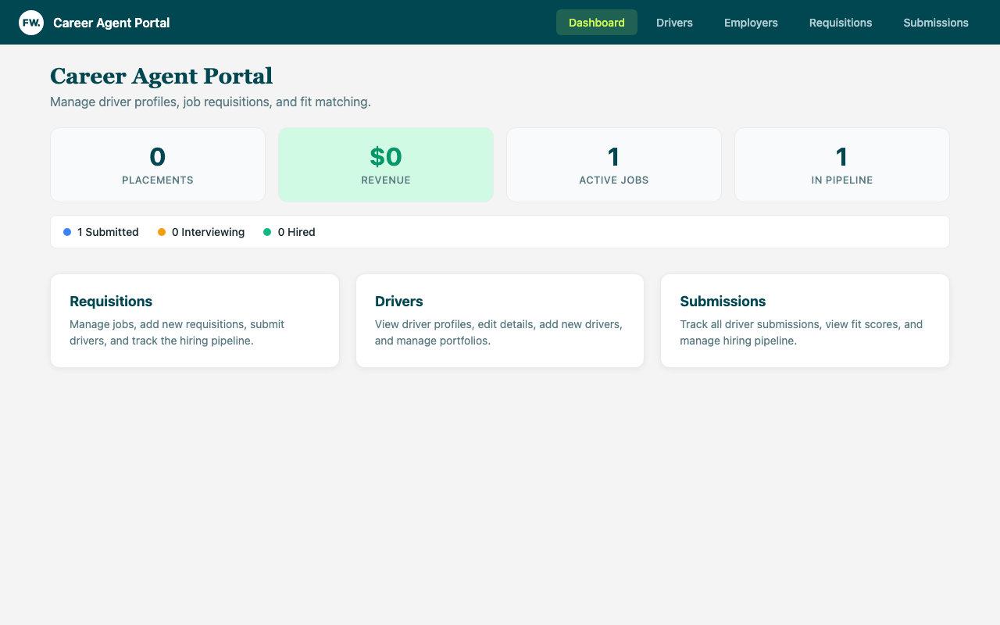

The pipeline breakdown shows status distribution across all submissions.

---

## 3. Adding a New Driver

**URL:** `/admin/drivers`

### Step 1: Navigate to Drivers

Click **Drivers** in the sidebar or the Drivers card on the dashboard.

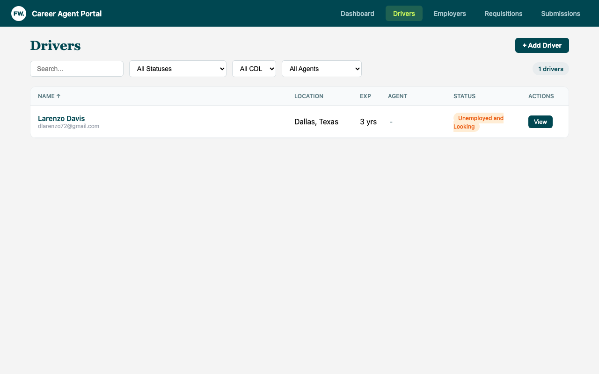

### Step 2: Click "+ Add Driver"

This opens the Add Driver modal with a 3-step wizard:

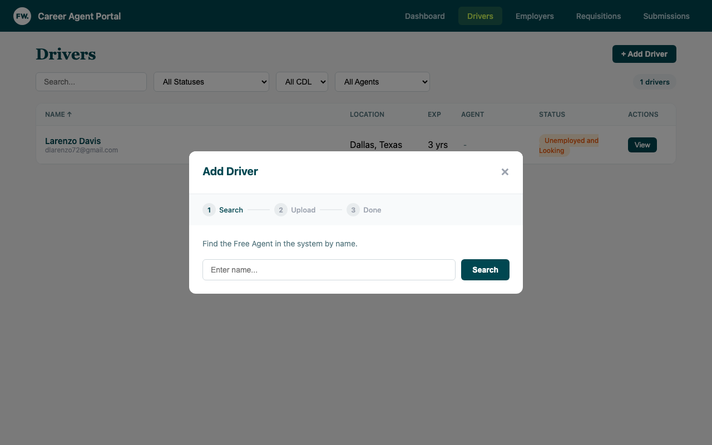

### Step 3: Search for the Free Agent

Enter the driver's name and click **Search**. The system searches:
1. **Free Agents** table (synced from main FreeWorld database)
2. **Existing Drivers** (already in CAP)

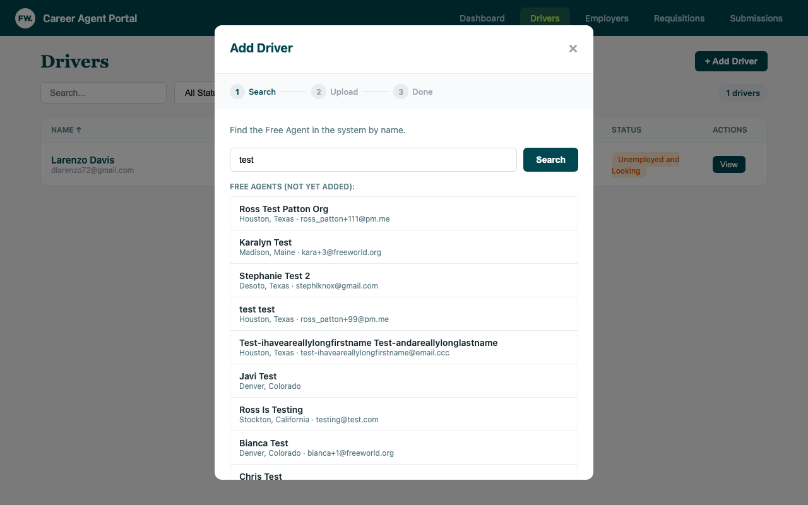

- **If found in Free Agents:** Click their name to select them
- **If already in Drivers:** Click to open their existing profile
- **If not found:** Click "Add Manually" to enter their info

### Step 4: Upload Documents

Upload any available documents (Tenstreet, MVR, PSP, Clearinghouse). These are parsed by AI to extract:
- Employment history
- Violations and accidents
- Compliance status
- Training information

Click **Parse & Generate** to process documents and create the profile.

### Step 5: Copy Links

After creation, you'll receive three links:

| Link | Purpose |
|------|---------|
| **Preferences Form** | Driver fills out job preferences, home time, pay requirements |
| **Video Recording** | Driver records their 6-part story video |
| **Portfolio** | Public profile page to share with employers |

Click **Shorten** to create a short link, then **Copy** to send to the driver.

### Viewing Driver Details

Click **View** on any driver to see their full profile:

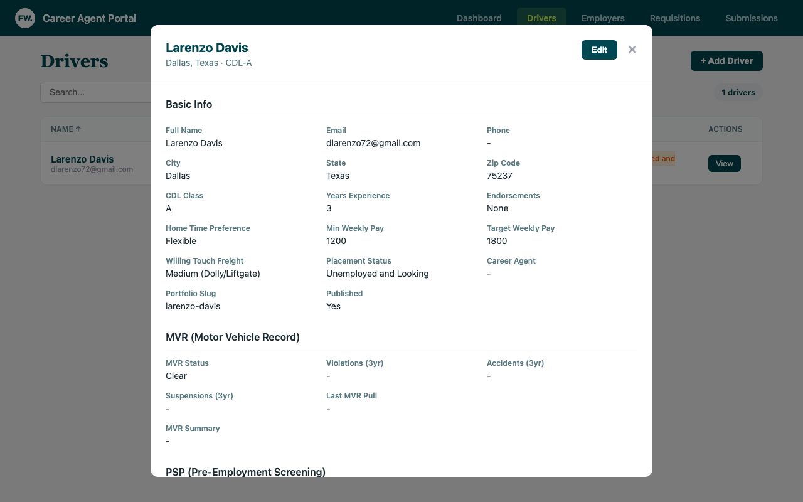

The profile shows:
- **Basic Info** - Contact details, location, CDL class, experience
- **Preferences** - Home time, pay requirements, touch freight tolerance
- **MVR** - Motor Vehicle Record status and violations
- **PSP** - Pre-Employment Screening data
- **Compliance** - Medical card, clearinghouse status
- **Story Transcripts** - Video transcriptions
- **AI Content** - Generated narrative, pull quotes, recruiter notes
- **Video Status** - Recording progress and final video link

---

## 4. Sending the Preferences Form

**URL:** `/form/{uuid}`

The Preferences Form collects:
- Preferred route type (Local, Regional, OTR)
- Home time requirements
- Minimum/target weekly pay
- Touch freight tolerance
- Equipment experience
- Special considerations

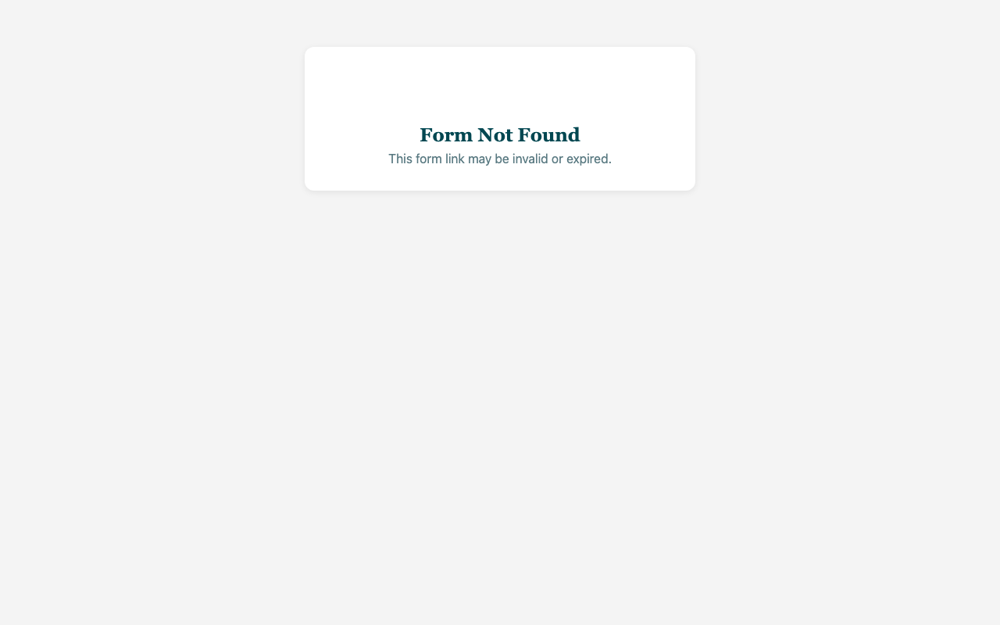

**How to send:**
1. Open the driver's profile (click "View" on Drivers page)
2. Click **Get Short Link** next to "Preferences Form"
3. Text or email the short link to the driver

---

## 5. Walking Through the Video Recording

**URL:** `/record/{uuid}`

The Video Recorder guides drivers through recording 6 story segments:

1. **Who Are You?** - Introduction and background
2. **What Is Your Why?** - Motivation and purpose
3. **FreeWorld Journey** - Their experience with the program
4. **Why Trucking?** - Career choice explanation
5. **What Are You Looking For?** - Job preferences
6. **What Others Say** - Testimonial about their character

**Tips for drivers:**
- Find a quiet, well-lit space
- Look into the camera
- Keep answers to 30-60 seconds each
- Be authentic - employers want to see the real person

After all clips are recorded, the system automatically:
1. Uploads clips to cloud storage (Cloudflare R2)
2. Transcribes audio using Deepgram
3. Assembles final video with Remotion
4. Saves video URL to their profile

---

## 6. Creating Employers

**URL:** `/admin/employers`

Before adding job requisitions, the employer must exist in CAP. Employers are imported from HubSpot.

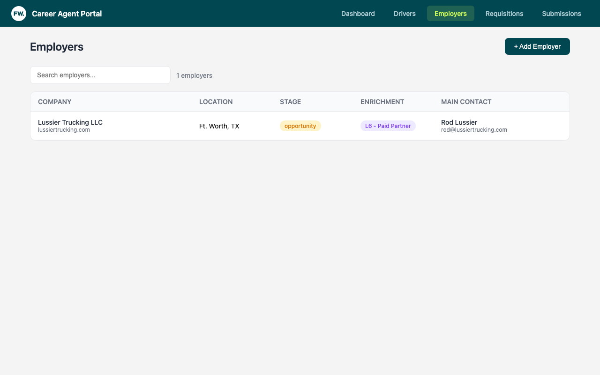

### Prerequisites in HubSpot

**Before you can import an employer to CAP, ensure in HubSpot:**

1. **Company is assigned to Employer Partnerships team** (Team ID: 58551370)
2. **Lifecycle stage is "Customer" or "Opportunity"** (other stages won't appear in search)
3. **At least one contact is associated** with the company
4. **Contact has an email address** (required for Employer Portal magic links)

### Adding an Employer

1. Click **+ Add Employer**
2. Search for the company in HubSpot

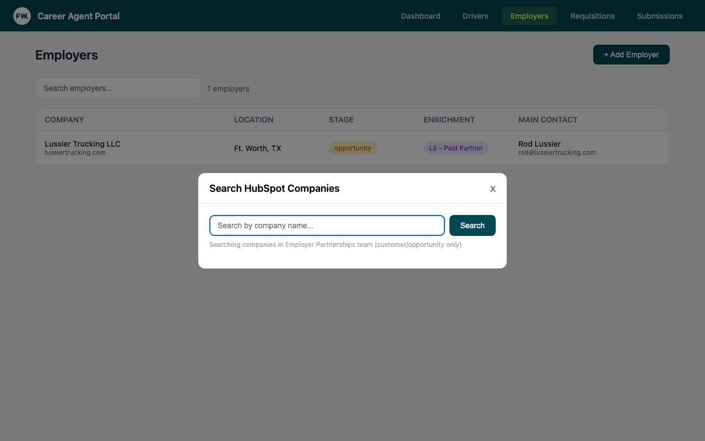

3. Select the company from search results
4. Review company details and main contact
5. Click **Add to CAP**

### What Gets Imported

The following fields are pulled from HubSpot:

**Company Info:**
| HubSpot Field | CAP Field |
|---------------|-----------|
| Company ID | `hubspot_company_id` |
| Parent Company ID | `hubspot_parent_company_id` |
| Name | `name` |
| Domain | `domain` |
| Phone | `phone` |
| City | `city` |
| State | `state` |
| Zip | `zip` |
| Lifecycle Stage | `lifecycle_stage` |
| Employer Enrichment Tier | `employer_enrichment_tier` |

**Main Contact (First Associated Contact):**
| HubSpot Field | CAP Field |
|---------------|-----------|
| First Name + Last Name | `main_contact_name` |
| Email | `main_contact_email` |
| Phone | `main_contact_phone` |
| Mobile Phone | `main_contact_mobile` |

### Employer Not Appearing in Search?

If you can't find an employer in CAP's HubSpot search:

1. **Check lifecycle stage** - Must be "Customer" or "Opportunity"
2. **Check team assignment** - Must be assigned to Employer Partnerships team
3. **Wait for sync** - HubSpot changes may take a few minutes to propagate

---

## 7. Adding Job Requisitions

**URL:** `/admin/requisitions`

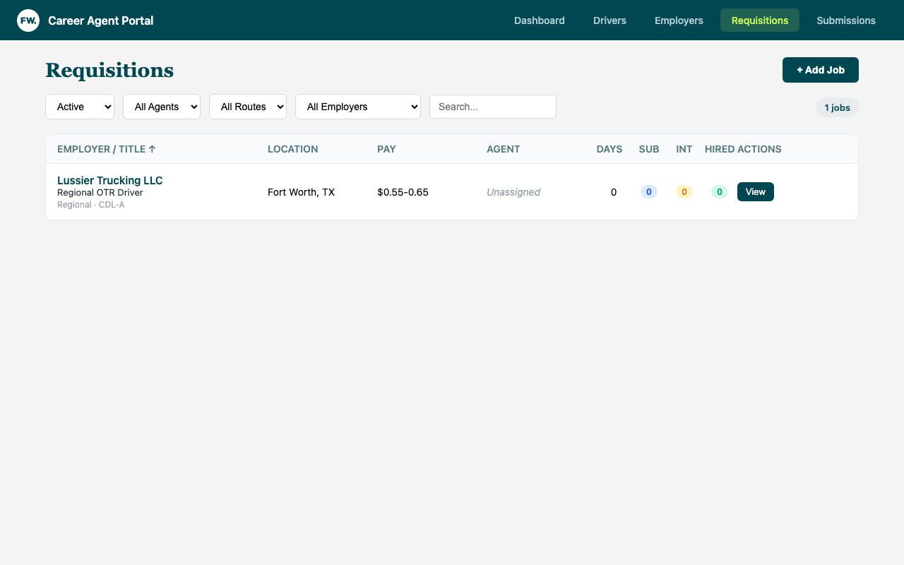

### Creating a New Job

1. Click **+ Add Job**
2. Paste the job description from the employer

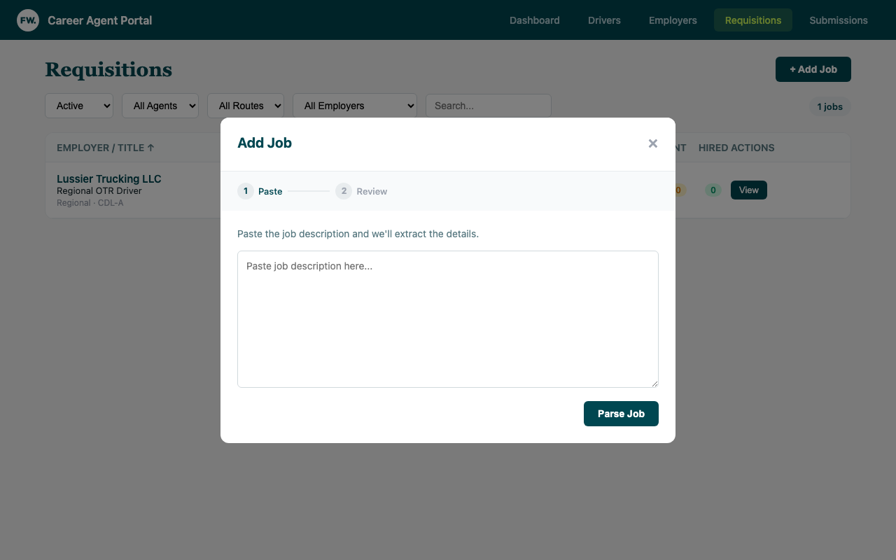

3. Click **Parse Job** - AI extracts:
   - Employer name
   - Title, location, yard zip
   - Route type, CDL class
   - Pay range
   - Home time, touch freight
   - Experience requirements

4. **Select the Employer** from the dropdown (required)
5. Review/edit extracted fields
6. Click **Save Job**

### Job Status Lifecycle

| Status | Meaning |
|--------|---------|
| **Active** | Open and accepting submissions |
| **On Hold** | Temporarily paused |
| **Filled** | Position has been filled |
| **Closed** | No longer available |

---

## 8. Submitting Drivers to Jobs

From the Requisitions page, click **View** on any job to open the detail modal.

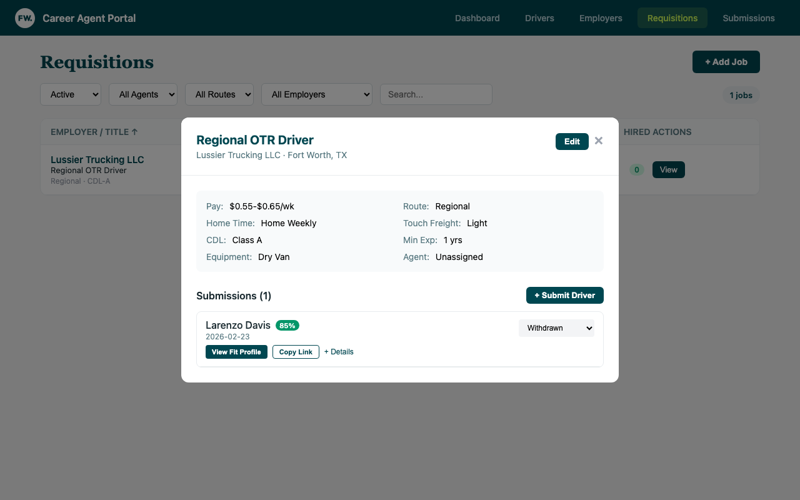

The job detail shows:
- Job requirements (pay, route, home time, CDL, experience)
- Agent assignment
- Current submissions with fit scores and statuses

### Submitting a Driver

1. Click **+ Submit Driver**

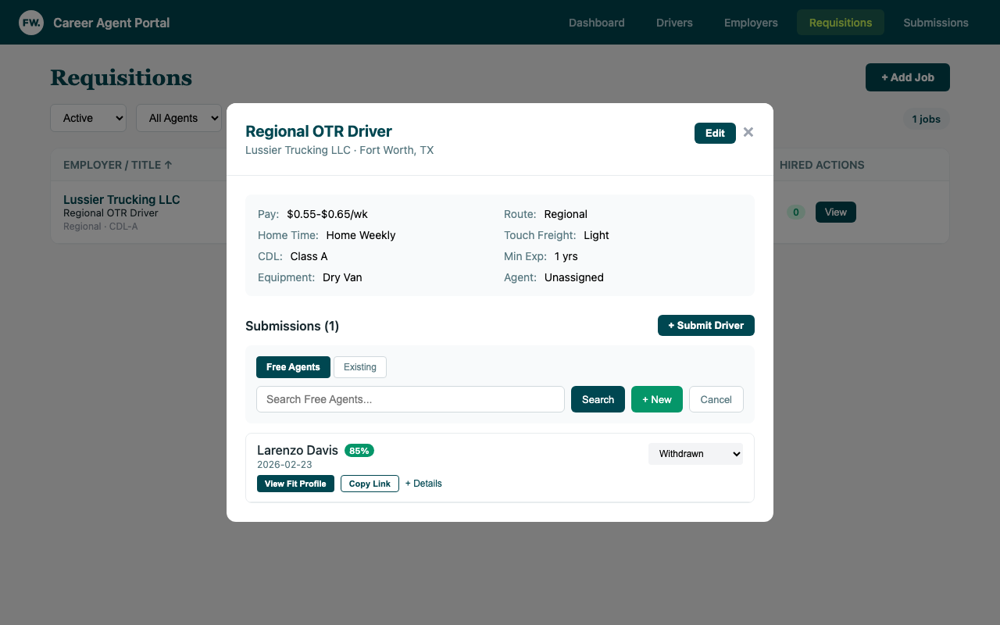

2. Choose search mode:
   - **Free Agents** - Search the main FreeWorld database
   - **Existing** - Search drivers already in CAP
3. Search by name
4. Click **Submit** next to the driver

The submission:
- Creates a fit profile automatically
- Links driver to requisition
- Calculates fit score based on driver preferences vs. job requirements

### Fit Score Badges

Each submission shows a fit score (0-100):
- **85+** (green) - Strong match
- **70-84** (yellow) - Good match with some gaps
- **Below 70** (red) - Potential misalignment

Click **View Fit Profile** to see dimension breakdowns and AI recommendation.

### Fit Score Dimensions

| Dimension | What It Measures |
|-----------|------------------|
| Route & Schedule | Local/Regional/OTR match, home time alignment |
| Equipment | Experience with required trailer types |
| Experience | Years of driving experience vs. requirements |
| Compensation | Driver's pay expectations vs. job pay range |
| Background | MVR, PSP, compliance status |
| Requirements | CDL class, endorsements, certifications |
| Commute | Distance from driver's home to yard |

### Creating a New Driver on the Fly

If the driver isn't in the system:
1. Click **+ New**
2. Enter name, email, phone, city, state
3. Click **Create & Submit**

---

## 9. Managing the Pipeline

**URL:** `/admin/submissions`

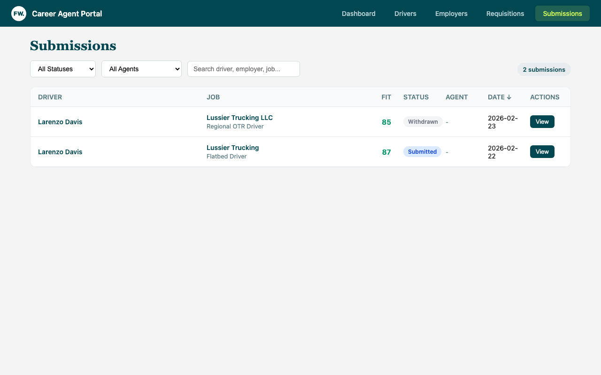

### Submission Statuses

| Status | Meaning | Action |
|--------|---------|--------|
| **Submitted** | Initial state, awaiting employer response | Follow up with employer |
| **Interviewing** | Employer is interviewing the driver | Prepare driver, gather feedback |
| **Offer Extended** | Employer made an offer | Help driver evaluate, negotiate if needed |
| **Hired** | Driver accepted and started | Celebrate! Log hire date |
| **Rejected** | Employer passed on driver | Log reason, find alternative jobs |
| **Withdrawn** | Driver withdrew from consideration | Understand why, find better fit |

### Updating Status

1. Click **View** on any submission
2. Select new status from dropdown
3. If Rejected, select reason:
   - No Response
   - Failed Background
   - Client Rejected
   - Driver Declined
   - Position Filled
4. If Hired, enter hire date

### Viewing Submission Details

Click **View** on any submission to see the full fit analysis:

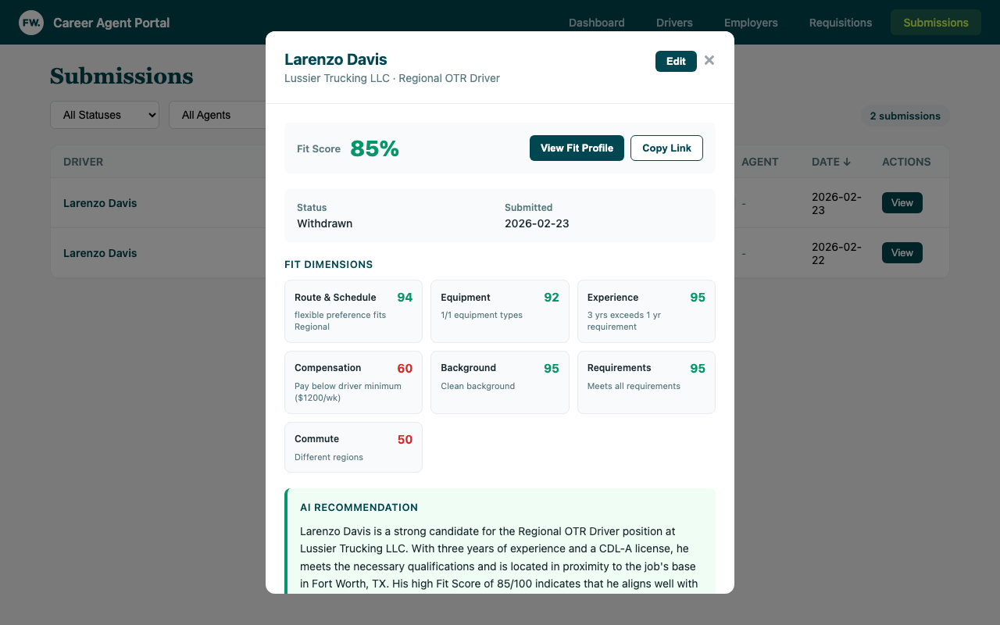

The detail view shows:
- **Fit Score** - Overall match percentage
- **Status & Date** - Current status and submission date
- **Fit Dimensions** - Breakdown by category with individual scores
- **AI Recommendation** - Personalized analysis of the match

### Sharing Fit Profiles

Click **Copy Link** to get a shareable URL for the fit profile. This is useful for:
- Sending to employers as part of driver introduction
- Internal team discussions about candidate fit
- Documentation for placement decisions

---

## 10. Employer Portal

**URL:** `/employer`

The Employer Portal is an external-facing portal for employer partners. It allows employers to self-serve without needing to contact a Career Agent for every action.

### How Employers Access the Portal

1. Employer visits `/employer/login`
2. Enters their email address (must match `main_contact_email` in CAP)
3. Receives a magic link via email (expires in 15 minutes)
4. Clicks the link to authenticate

**Important:** The magic link only works if the email matches an employer's `main_contact_email` in CAP. This is pulled from HubSpot during employer import.

### What Employers Can Do

| Feature | Description |
|---------|-------------|
| **Dashboard** | View key metrics and recent activity |
| **Job Requisitions** | Add and manage job openings |
| **Driver Feed** | Browse qualified candidates (70+ fit score) |
| **Request Interviews** | Express interest in specific drivers |
| **Track Submissions** | View submission status and provide feedback |

### Driver Feed

The Driver Feed shows candidates who:
- Have a fit score of 70+ against the employer's jobs
- Have completed their profile and preferences

Employers can:
- Filter by specific job requisition
- Sort by fit score, experience, or recent activity
- Click to view full driver profile
- Request an interview (creates a submission and notifies Career Agent)

### Career Agent Notifications

When an employer requests an interview:
1. A submission is created in CAP with status "Submitted"
2. The Career Agent receives an email notification
3. The Career Agent follows up with both the driver and employer

---

## 11. HubSpot Integration

### How CAP Connects to HubSpot

CAP pulls employer data from HubSpot via the CRM API. This is a one-way sync - changes made in CAP are NOT pushed back to HubSpot.

### HubSpot Requirements for CAP

For an employer to appear in CAP's search and work correctly:

| Requirement | Where to Set | Why |
|-------------|--------------|-----|
| Team = Employer Partnerships | HubSpot Company > Owner/Team | CAP filters by team ID 58551370 |
| Lifecycle = Customer or Opportunity | HubSpot Company > Lifecycle Stage | CAP only shows these stages |
| Has Associated Contact | HubSpot Company > Contacts | Needed for main_contact fields |
| Contact Has Email | HubSpot Contact > Email | Required for Employer Portal magic links |

### HubSpot Fields Used by CAP

**Company Properties:**
- `name` (required)
- `domain`
- `phone`
- `city`
- `state`
- `zip`
- `lifecyclestage`
- `employer_enrichment_tier`
- `hs_parent_company_id`
- `hubspot_team_id` (for filtering)

**Contact Properties:**
- `firstname`
- `lastname`
- `email` (critical for Employer Portal)
- `phone`
- `mobilephone`
- `jobtitle`

### Employer Partnerships Pipeline Stages

The Employer Partnerships pipeline in HubSpot tracks the sales process:

| Stage | Probability | Meaning |
|-------|-------------|---------|
| Scheduled Call | 20% | Initial outreach scheduled |
| Pilot Scoping | 40% | Discussing pilot parameters |
| Sending Candidates | 60% | Actively sending drivers |
| First Hire | 80% | One placement made |
| Multiple Hires | 90% | Multiple placements |
| Won | 100% | Active partner |
| Lost | 0% | Partnership didn't work out |

### Company Lifecycle Stages Relevant to CAP

| Stage | Shows in CAP? | Notes |
|-------|---------------|-------|
| Lead | No | Not ready for placements |
| Opportunity | Yes | Actively pursuing |
| Customer | Yes | Active employer partner |
| FA Employer | No | Custom stage - check team assignment |
| FreeWorld Employer Partner | No | Custom stage - check team assignment |

---

## Quick Reference

### Key URLs

| Page | URL |
|------|-----|
| Dashboard | `/admin` |
| Drivers | `/admin/drivers` |
| Employers | `/admin/employers` |
| Requisitions | `/admin/requisitions` |
| Submissions | `/admin/submissions` |
| Driver Form | `/form/{uuid}` |
| Video Recorder | `/record/{uuid}` |
| Portfolio | `/portfolio/{slug}` |
| Employer Portal | `/employer` |

### Filters & Sorting

All list pages support:
- **Status filter** - Show only specific statuses
- **Agent filter** - Show only your assigned records
- **Search** - Filter by name, employer, location
- **Sort** - Click column headers to sort

### Keyboard Shortcuts

- **Enter** - Submit search/form
- **Escape** - Close modal (click outside also works)

---

## Workflow Checklists

### New Driver Onboarding

- [ ] Search/create driver in CAP
- [ ] Upload Tenstreet, MVR, PSP documents
- [ ] Parse documents with AI
- [ ] Send Preferences Form link
- [ ] Send Video Recording link
- [ ] Verify video completed
- [ ] Review portfolio before sharing

### New Employer Setup

- [ ] Verify employer in HubSpot has:
  - [ ] Lifecycle stage = Customer or Opportunity
  - [ ] Team = Employer Partnerships
  - [ ] Associated contact with email
- [ ] Import employer to CAP
- [ ] Verify main contact info
- [ ] Send Employer Portal login instructions (if applicable)

### Job Matching

- [ ] Ensure employer exists in CAP
- [ ] Create job requisition from posting
- [ ] Assign yourself as Career Agent
- [ ] Submit qualified drivers
- [ ] Track submission statuses
- [ ] Follow up on interviews
- [ ] Log placements

---

## Troubleshooting

### Driver not showing in search?
- Check spelling variations
- Try first name only
- Use "Add Manually" if truly new

### Employer not showing in HubSpot search?
- Verify lifecycle stage is "Customer" or "Opportunity"
- Verify team is Employer Partnerships (ID: 58551370)
- Check that the company exists in HubSpot at all
- Wait a few minutes and try again

### Employer Portal magic link not working?
- Verify `main_contact_email` matches the email they're using
- Check that the employer exists in CAP (not just HubSpot)
- Magic links expire after 15 minutes

### Video not appearing?
- Check video_status field in driver profile
- Allow 5-10 minutes for processing
- Contact tech support if stuck in "processing"

### Fit score missing?
- Fit profiles generate automatically when:
  - Driver has job preferences filled out
  - Job has requirements filled out
- Edit submission to manually enter scores

---

**FreeWorld**

*Building pathways to employment*

[freeworld.org](https://freeworld.org)

---

*Last updated: February 2026*
